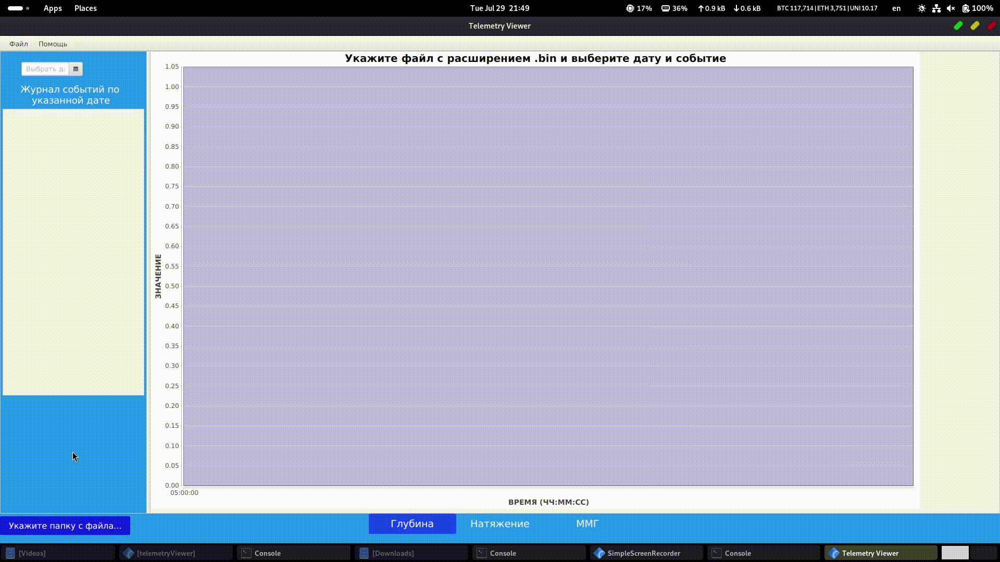

# TelemetryViewer
## Overview
TelemetryViewer is a cross-platform application designed for viewing, analyzing, and exporting telemetry data. It provides tools to load binary telemetry datasets, visualize data interactively, and export logs in LAS format for use in geological or oilfield logging systems.

### Select & View dataset



### Generate LAS file


---

## Getting started
### System Requirements
> Windows or Linux (x64)

> Java 11 or higher installed

### Download Binaries

Download the latest compiled `.jar` and native library from the [Releases](https://github.com/Emile1154/TelemetryViewer/releases) page.
> ⚠️  To run **TelemetryViewer**, the executable (`telemetryViewer.jar`) and its required dynamic library (`.dll` or `.so`) **must be in the same folder**.

```bash
    java -jar telemetryViewer.jar
``` 

## Building locally

### Build JAR File 

To build the executable `.jar` file, use **Eclipse IDE** or **IntelliJ IDEA**.
```bash
    git clone https://github.com/Emile1154/TelemetryViewer.git
``` 

###  Build Native Library (`.dll` / `.so`)

To build the dynamic library required by the JAR, run:
```bash
make
```
> Need C++ compiler (g++ on Linux, MinGW on Windows) 

> Builds output to the `build/` folder.


## Binary File Format
The HEAD and FOOT sections contain metadata and event markers, while the BODY holds sensor arrays as depth, tension, magnet tag readings.
### Package Structure
```
+-------------------------+
| HEAD |
| telemetry_data_t |
| └─> telemetry_event_t |
+-------------------------+
| BODY |
| telemetry_data_t |
| ├─ depth [10] |
| ├─ tension [10] |
| ├─ magnet [10] |
| └─ ... |
+-------------------------+
| FOOT |
| telemetry_data_t |
| └─> telemetry_event_t |
+-------------------------+
```